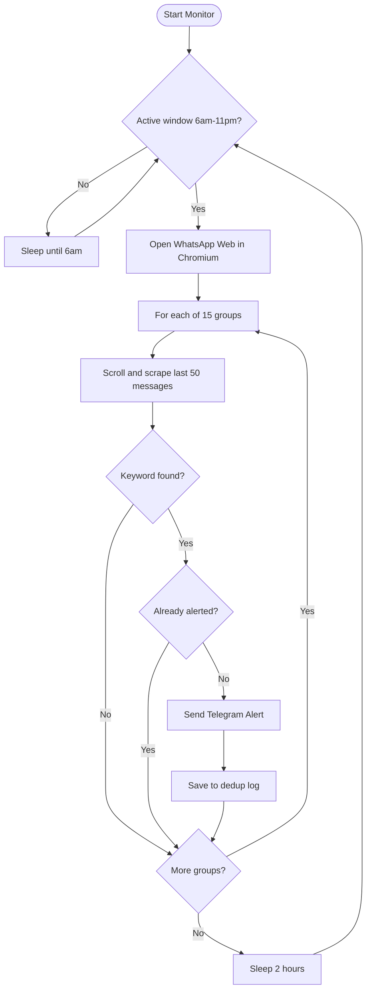

# WhatsApp Accommodation Monitor


> **Automatically monitors 15+ WhatsApp accommodation groups in Dublin and sends instant Telegram alerts when your target apartments are mentioned.**

---

## The Problem

Dublin's rental market is brutally competitive. Affordable accommodation — especially near university campuses — disappears within hours of being posted. Students and new arrivals often miss listings because:

- Posts appear across **15+ different WhatsApp groups** simultaneously
- You can't watch all groups manually throughout the day
- By the time you see a message, the room is already gone

**This tool watches every group for you, 24/7, and pings your Telegram the moment a matching post appears.**

---

## How It Works



---

## Features

| Feature | Detail |
|---|---|
| **15 WhatsApp groups** | Scanned every 2 hours, 6am–11pm |
| **Keyword matching** | Case-insensitive, partial match (e.g. "Vantage", "VANTAGE", "Vantage Apartments" all match) |
| **Instant Telegram alert** | Formatted message with group name, sender, and full message text |
| **Zero duplicate alerts** | Persistent dedup log — same post never alerts twice |
| **Emoji-safe matching** | WhatsApp renders group names with `` tags; uses HTML `title` attribute for accurate matching |
| **Session persistence** | QR code scan only needed once — session saved to disk |
| **Docker support** | One command to deploy on any Linux server |

---

## Alert Format

When a keyword match is found, you receive this in Telegram:

```
Accommodation Alert — 30 Apr 2026, 08:00
Found 1 new mention(s) of: vantage, central park, occu east

1. [Accommodation 1️⃣| 🇮🇳Indians in Ireland🇮🇪]
From: Priya K.
Message: Vantage apartments has rooms available from May 15th,
2BHK fully furnished €1800/month, DM me for details...

Act fast — accommodation goes quickly!
```

---

## Setup

### Prerequisites

- Python 3.11+
- A WhatsApp account
- A Telegram bot (free — takes 2 minutes)

### 1. Install dependencies

```bash
pip install -r requirements.txt
playwright install chromium
```

### 2. Create a Telegram bot

1. Open Telegram → search **@BotFather** → send `/newbot`
2. Copy the token it gives you
3. Send any message to your new bot
4. Open `https://api.telegram.org/bot<YOUR_TOKEN>/getUpdates` in a browser
5. Copy the number after `"chat":{"id":`

### 3. Configure credentials

Create a `.env` file (never committed to git):

```env
TELEGRAM_BOT_TOKEN=your_bot_token_here
TELEGRAM_CHAT_ID=your_chat_id_here
```

### 4. Configure groups and keywords

Edit `config.py`:

```python
GROUPS_TO_MONITOR = [
    "Your Group Name Here",   # paste exact name from WhatsApp
]

KEYWORDS = [
    "vantage",
    "central park",
    "occu east",
]
```

### 5. First run — scan QR code

```bash
python monitor.py --once
```

A Chromium browser opens WhatsApp Web. On your phone:
**WhatsApp → Settings → Linked Devices → Link a Device** → scan the QR code.

The session is saved to `whatsapp_session/` — you won't need to scan again.

---

## Usage

```bash
# Test a single scan
python monitor.py --once

# Run continuously (every 2h, 6am–11pm)
python monitor.py
```

**Schedule**: scans at 06:00, 08:00, 10:00, 12:00, 14:00, 16:00, 18:00, 20:00, 22:00 — then sleeps until 06:00 next day.

---

## Docker Deployment

Run the monitor on a cloud VM (24/7, no laptop needed).

```bash
# 1. Build the image
docker compose build

# 2. Copy your WhatsApp session from your laptop first
#    (so the container doesn't need to scan QR again)
#    scp -r ./whatsapp_session user@your-server:/path/to/project/

# 3. Start
docker compose up -d

# 4. View logs
docker compose logs -f
```

> **Note**: Set `HEADLESS = True` in `config.py` before running in Docker (no display available on a server).

---

## Testing

```bash
pip install pytest
pytest tests/ -v
```

Tests cover keyword matching, deduplication logic, normalisation, and schedule calculation — all without needing a browser or Telegram connection.

---

## Project Structure

```
.
├── monitor.py              # Core automation — browser, scraping, alerts
├── config.py               # All settings (groups, keywords, schedule)
├── requirements.txt        # Runtime dependencies (Playwright)
├── requirements-dev.txt    # Dev dependencies (pytest)
├── tests/
│   └── test_monitor.py     # Unit tests
├── Dockerfile              # Container definition
├── docker-compose.yml      # One-command deployment
├── .env                    # Telegram credentials — NOT in git
├── .env.example            # Template showing required variables
├── whatsapp_session/       # Saved browser session — NOT in git
└── monitor_log.json        # Seen message IDs (dedup) — NOT in git
```

---

## Technical Notes

**Why Playwright over requests/BeautifulSoup?**
WhatsApp Web is a React SPA that requires JavaScript execution. A real browser is the only reliable way to interact with it.

**Why does emoji matching need special handling?**
WhatsApp renders flag emoji (🇮🇳🇮🇪) as `` tags in the DOM. Calling `innerText()` drops them entirely, causing group name matches to fail. Reading the `title` HTML attribute returns the full Unicode string including emoji.

**Why exact-match-first in group search?**
Some group names are substrings of others (e.g. `ಕನ್ನಡಿಗರು 🇮🇳 ಐರ್ಲೆಂಡ️ 🇮🇪` vs `ಕನ್ನಡಿಗರು 🇮🇳 ಐರ್ಲೆಂಡ️ 🇮🇪 2`). The scanner checks for an exact match first; partial match is only the fallback.

---

## License

MIT — see [LICENSE](LICENSE)
